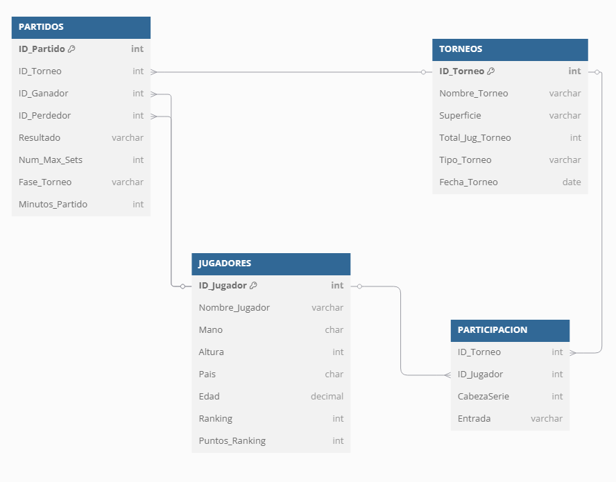

# 🥎 TFG - Machine learning aplicado al tenis
Proyecto de fin de grado de la UPM para el grado de sistemas de la información intentando basarnos en machine learning para realizar un modelo predictivo de resultados y rendimientos en el tenis.

En este README, nos centraremos en explicar la base de datos que crearemos y así como el contenido de la misma.

---

## 📎 Creditos

| Name                        | UPM Mail                            | LinkedIn                                                                         | 
| --------------------------- | ----------------------------------- | -------------------------------------------------------------------------------- | 
| Ismael Arroyo Madera        | ismael.arroyo.madera@alumnos.upm.es | [Ismael Arroyo][(https://www.linkedin.com/in/ismael-arroyo-madera-3a4a861a1/)]   | 
| Roberto Sanz López          | roberto.sanzl@alumnos.upm.es        | [Roberto Sanz][(https://www.linkedin.com/in/roberto-sanz-l%C3%B3pez-57b0bb2a9/)] | 

---

## 📦 Tablas

### 🙎‍♂️ Jugadores
| Field           | Type               |
|-----------------|--------------------|
| ID_Jugador      | INT PRIMARY KEY    |
| Nombre_Jugador  | VARCHAR(100)       |
| Mano            | CHAR(1)            |
| Altura          | INT                |
| Pais            | CHAR(3)            |
| Edad            | INT                |
| Ranking         | INT                |
| Puntos_Ranking  | INT                |

Para crear la tabla JUGADORES, necesitaremos ejeuctar el siguiente código:

```sql
 CREATE TABLE JUGADORES (
    ID_Jugador INT PRIMARY KEY,
    Nombre_Jugador VARCHAR(100),
    Mano CHAR(1),
    Altura INT,
    Pais CHAR(3),
    Edad DECIMAL(4,1),
    Ranking INT,
    Puntos_Ranking INT
);
```

### 🎾 Torneos
| Field            | Type               |
|------------------|--------------------|
| ID_Torneo        | INT PRIMARY KEY    |
| Nombre_Torneo    | VARCHAR(100)       |
| Superficie       | VARCHAR(50)        |
| Total_Jug_Torneo | INT                |
| Tipo_Torneo      | VARCHAR(50)        |
| Fecha_Torneo     | DATE               |

Para crear la tabla TORNEOS, necesitaremos ejeuctar el siguiente código:

```sql
CREATE TABLE TORNEOS (
    ID_Torneo INT PRIMARY KEY,
    Nombre_Torneo VARCHAR(100),
    Superficie VARCHAR(50),
    Total_Jug_Torneo INT,
    Tipo_Torneo VARCHAR(50),
    Fecha_Torneo DATE
);
```


### 🏆 Torneos
| Field                         | Type               |
|-------------------------------|--------------------|
| ID_Partido                    | INT PRIMARY KEY    |
| ID_Torneo                     | INT NOT NULL       |
| ID_Ganador                    | INT NOT NULL       |
| ID_Perdedor                   | INT NOT NULL       |
| Resultado                     | VARCHAR(50)        | 
| Num_Max_Sets                  | INT                | 
| Fase_Torneo                   | VARCHAR(50)        |
| Minutos_Partido               | INT                |
| Ganador_Aces                  | INT                |
| DoblesFaltas_Ganador          | INT                |
| Ganador_PuntosServicio        | INT                |
| Ganador_1ServHecho            | INT                |
| Ganador_1ServGanado           | INT                |
| Ganador_2ServGanado           | INT                |
| Ganador_JuegConServicio       | INT                |
| Ganador_BreakPoints_Salvados  | INT                |
| Ganador_BreakPoints_Perdidos  | INT                |
| Perdedor_Aces                 | DATE               |
| Perdedor_DoblesFaltas         | VARCHAR(50)        |
| PuntosServicio_Perdedor       | INT                |
| Perdedor_1ServHecho           | VARCHAR(50)        |
| Perdedor_1ServGanado          | DATE               |
| Perdedor_2ServGanado          | VARCHAR(50)        |
| Perdedor_JuegConServicio      | INT                |
| Perdedor_BreakPoints_Salvados | VARCHAR(50)        |
| Perdedor_BreakPoints_Perdidos | DATE               |

Para crear la tabla PARTIDOS, necesitaremos ejeuctar el siguiente código:

```sql
CREATE TABLE PARTIDOS (
    ID_Partido INT PRIMARY KEY,
    ID_Torneo INT NOT NULL,
    ID_Ganador INT NOT NULL,
    ID_Perdedor INT NOT NULL,
    Resultado VARCHAR(50),
    Num_Max_Sets INT,
    Fase_Torneo VARCHAR(50),
    Minutos_Partido INT,
    
    -- Estadísticas Ganador
    Ganador_Aces INT,
    DoblesFaltas_Ganador INT,
    Ganador_PuntosServicio INT,
    Ganador_1ServHecho INT,
    Ganador_1ServGanado INT,
    Ganador_2ServGanado INT,
    Ganador_JuegConServicio INT,
    Ganador_BreakPoints_Salvados INT,
    Ganador_BreakPoints_Perdidos INT,
    
    -- Estadísticas Perdedor
    Perdedor_Aces INT,
    Perdedor_DoblesFaltas INT,
    PuntosServicio_Perdedor INT,
    Perdedor_1ServHecho INT,
    Perdedor_1ServGanado INT,
    Perdedor_2ServGanado INT,
    Perdedor_JuegConServicio INT,
    Perdedor_BreakPoints_Salvados INT,
    Perdedor_BreakPoints_Perdidos INT,

    -- Relaciones
    FOREIGN KEY (ID_Torneo) REFERENCES TORNEOS(ID_Torneo),
    FOREIGN KEY (ID_Ganador) REFERENCES JUGADORES(ID_Jugador),
    FOREIGN KEY (ID_Perdedor) REFERENCES JUGADORES(ID_Jugador)
);

```
### 🎫 Participación
### 🎾 Torneos
| Field        | Type               |
|--------------|--------------------|
| ID_Torneo    | INT                |
| ID_Jugador   | INT                |
| CabezaSerie  | INT                |
| Entrada      | VARCHAR(10)        |

Para crear la tabla PARTICIPACION, necesitaremos ejeuctar el siguiente código:

```sql
CREATE TABLE PARTICIPACION (
    ID_Torneo INT,
    ID_Jugador INT,
    CabezaSerie INT,
    Entrada VARCHAR(10),
    PRIMARY KEY (ID_Torneo, ID_Jugador),
    FOREIGN KEY (ID_Torneo) REFERENCES TORNEOS(ID_Torneo),
    FOREIGN KEY (ID_Jugador) REFERENCES JUGADORES(ID_Jugador)
);
```
## 📐 Diagrama base de datos

El siguiente diagrama ilustra la estructura de nuestra base de datos, incluyendo tablas y las claves.



Este esquema ofrece una vista de cómo las diferentes entidades interactuan con el sistema. Esto puede ayudarnos a entender mejor el flujo de datos y asegurarnos del diseño de la base de datos.
