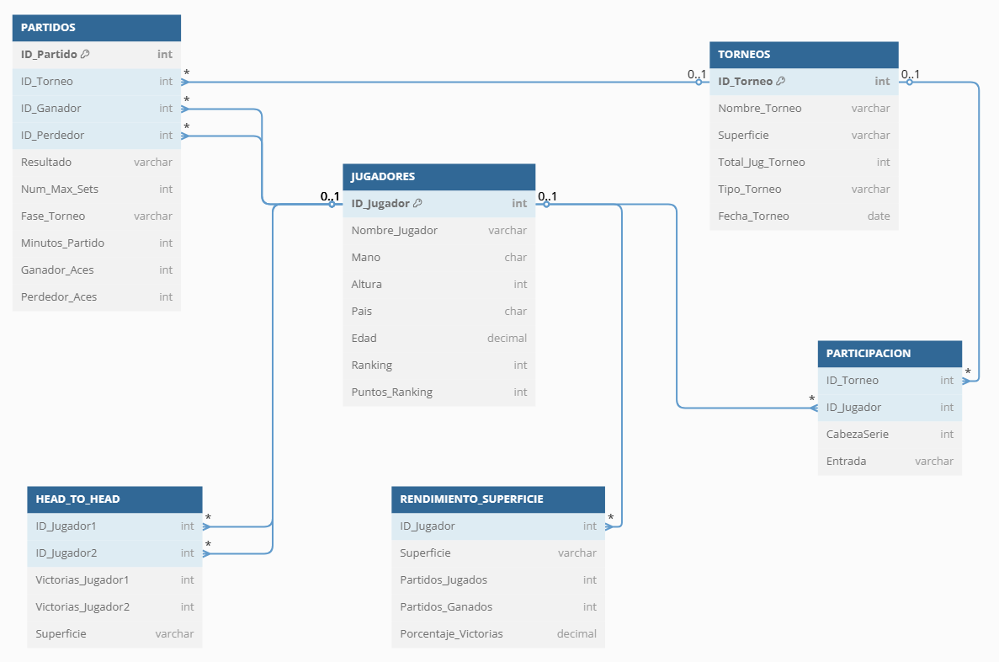

# 🥎 TFG - Machine learning aplicado al tenis
Proyecto de fin de grado de la UPM para el grado de sistemas de la información intentando basarnos en machine learning para realizar un modelo predictivo de resultados y rendimientos en el tenis.

En este README, nos centraremos en explicar la base de datos que crearemos y así como el contenido de la misma.

---

## 📎 Creditos

| Name                        | UPM Mail                            | LinkedIn                                                       | 
| --------------------------- | ----------------------------------- | -------------------------------------------------------------- | 
| Ismael Arroyo Madera        | ismael.arroyo.madera@alumnos.upm.es | https://www.linkedin.com/in/ismael-arroyo-madera-3a4a861a1/    | 
| Roberto Sanz López          | roberto.sanzl@alumnos.upm.es        | https://www.linkedin.com/in/roberto-sanz-l%C3%B3pez-57b0bb2a9/ | 

---
## 📁 Base de datos
Respecto a la base de datos, crearemos una con el nombre de **TFGDB** en la cual tendremos una instancia denominada **db2inst**.
Por otro lado, tendremos dos esquemas: **pruebas** y **db2inst**, uno para pruebas y el otro para el desarrollo del proyecto.

Para la gestión de la base de datos usaremos **DB2 LUW** que permite almacenar, gestionar y consultar datos estructurados.  

El proceso que hemos seguido, podemos verlo aquí: [Desarrollo de la base de datos: TFGDB](https://github.com/ertitopana/TFG/blob/main/DesarrolloTFGDB)

## 📦 Tablas

### 🙎‍♂️ Jugadores
| Atributo         | Tipo de Dato         | Descripción                       |
|------------------|----------------------|-----------------------------------|
| **ID_Jugador**   | INT PRIMARY KEY [PK] | Identificador único del jugador   |
| Nombre_Jugador   | VARCHAR(100)         | Nombre completo del jugador       |
| Mano             | CHAR(1)              | Mano dominante (diestro/zurdo)    |
| Altura           | INT                  | Altura en centímetros             |
| Pais             | CHAR(3)              | Código de país (ESP, USA, BUL...) |
| Edad             | INT                  | Edad del jugador                  |
| Ranking          | INT                  | Ranking actual del jugador        |
| Puntos_Ranking   | INT                  | Puntos acumulados en el ranking   | 

Para crear la tabla JUGADORES, necesitaremos ejeuctar el siguiente código:
```sql
 CREATE TABLE JUGADORES (
    ID_Jugador INT NOT NULL PRIMARY KEY,
    Nombre_Jugador VARCHAR(100),
    Mano CHAR(1),
    Altura INT,
    Pais CHAR(3),
    Edad DECIMAL(4,1),
    Ranking INT,
    Puntos_Ranking INT
);
```

### 🏆 Torneos
| Atributo         | Tipo de Dato         | Descripción                               |
|------------------|----------------------|-------------------------------------------|
| **ID_Torneo**    | INT PRIMARY KEY [PK] | Identificador único del torneo            |
| Nombre_Torneo    | VARCHAR(100)         | Nombre oficial del torneo                 |
| Superficie       | VARCHAR(50)          | Tipo de superficie (Césped, Tierra...)    |
| Total_Jug_Torneo | INT                  | Número total de jugadores participantes   |
| Tipo_Torneo      | VARCHAR(50)          | Nivel del torneo (Grand Slam, ATP 500..)  |
| Fecha_Torneo     | DATE                 | Fecha de inicio del torneo                |

Para crear la tabla TORNEOS, necesitaremos ejeuctar el siguiente código:
```sql
CREATE TABLE TORNEOS (
    ID_Torneo INT NOT NULL PRIMARY KEY,
    Nombre_Torneo VARCHAR(100),
    Superficie VARCHAR(50),
    Total_Jug_Torneo INT,
    Tipo_Torneo VARCHAR(50),
    Fecha_Torneo DATE
);
```


### 🎾 Partidos
| Atributo                      | Tipo de Dato         | Descripción                                     |
|-------------------------------|----------------------|-------------------------------------------------|
| **ID_Partido**                | INT PRIMARY KEY [PK] | Identificador único del partido                 |
| **ID_Torneo**                 | INT NOT NULL [FK]    | Torneo al que pertenece el partido              |
| **ID_Ganador**                | INT NOT NULL [FK]    | ID del jugador ganador                          |
| **ID_Perdedor**               | INT NOT NULL [FK]    | ID del jugador perdedor                         |
| Resultado                     | VARCHAR(50)          | Resultado del partido (6-4, 3-6, 7-5)           |
| Num_Max_Sets                  | INT                  | Número máximo de sets en el partido             |
| Fase_Torneo                   | VARCHAR(50)          | Fase del torneo (Final, Semifinal)              |
| Minutos_Partido               | INT                  | Duración del partido en minutos                 |
| Ganador_Aces                  | INT                  | Aces del ganador                                |
| DoblesFaltas_Ganador          | INT                  | Dobles faltas del ganador                       |
| Ganador_PuntosServicio        | INT                  | Puntos al servicio del ganador                  |
| Ganador_1ServHecho            | INT                  | Nº puntos jugados con primer servicio ganador   |
| Ganador_1ServGanado           | INT                  | Nº puntos ganados con primer servicio ganador   |
| Ganador_2ServGanado           | INT                  | Nº puntos ganados con segundo servicio ganador  |
| Ganador_JuegConServicio       | INT                  | Nº juegos ganados al servicio ganador           |
| Ganador_BreakPoints_Salvados  | INT                  | Puntos break salvados del ganador               |
| Ganador_BreakPoints_Perdidos  | INT                  | Puntos de break perdidos del ganador            |
| Perdedor_Aces                 | DATE                 | Aces del perdedor                               |
| Perdedor_DoblesFaltas         | VARCHAR(50)          | Dobles faltas del perdedor                      |
| PuntosServicio_Perdedor       | INT                  | Puntos al servicio del perdedor                 |
| Perdedor_1ServHecho           | VARCHAR(50)          | Nº puntos jugados con primer servicio perdedor  |
| Perdedor_1ServGanado          | DATE                 | Nº puntos ganados con primer servicio perdedor  |
| Perdedor_2ServGanado          | VARCHAR(50)          | Nº puntos ganados con segundo servicio perdedor |
| Perdedor_JuegConServicio      | INT                  | Nº juegos ganados al servicio perdedor          |
| Perdedor_BreakPoints_Salvados | VARCHAR(50)          | Puntos break salvados del perdedor              |
| Perdedor_BreakPoints_Perdidos | DATE                 | Puntos de break perdidos del perdedor           |
                                                        
Para crear la tabla PARTIDOS, necesitaremos ejeuctar el siguiente código:
```sql
CREATE TABLE PARTIDOS (
    ID_Partido INT NOT NULL PRIMARY KEY,
    ID_Torneo INT NOT NULL,
    ID_Ganador INT NOT NULL,
    ID_Perdedor INT NOT NULL,
    Resultado VARCHAR(50),
    Num_Max_Sets INT,
    Fase_Torneo VARCHAR(50),
    Minutos_Partido INT,
    
    -- Estadísticas del Ganador
    Ganador_Aces INT,
    DoblesFaltas_Ganador INT,
    Ganador_PuntosServicio INT,
    Ganador_1ServHecho INT,
    Ganador_1ServGanado INT,
    Ganador_2ServGanado INT,
    Ganador_JuegConServicio INT,
    Ganador_BreakPoints_Salvados INT,
    Ganador_BreakPoints_Perdidos INT,
    
    -- Estadísticas del Perdedor
    Perdedor_Aces INT,
    Perdedor_DoblesFaltas INT,
    PuntosServicio_Perdedor INT,
    Perdedor_1ServHecho INT,
    Perdedor_1ServGanado INT,
    Perdedor_2ServGanado INT,
    Perdedor_JuegConServicio INT,
    Perdedor_BreakPoints_Salvados INT,
    Perdedor_BreakPoints_Perdidos INT,
    
    -- Claves Foráneas
    FOREIGN KEY (ID_Torneo) REFERENCES TORNEOS(ID_Torneo),
    FOREIGN KEY (ID_Ganador) REFERENCES JUGADORES(ID_Jugador),
    FOREIGN KEY (ID_Perdedor) REFERENCES JUGADORES(ID_Jugador)
);
```
### 🎫 Participación

| Atributo       | Tipo de Dato       | Descripción                                       |
|----------------|--------------------|---------------------------------------------------|
| **ID_Torneo**  | INT [PK,FK]        | Torneo en el que participa el jugador             |
| **ID_Jugador** | INT [PK,FK]        | Jugador participante                              |
| CabezaSerie    | INT                | Número de cabeza de serie del jugador (si aplica) |
| Entrada        | VARCHAR(10)        | Cómo ingresó al torneo (Wildcard, Qualifier...)   | 

Para crear la tabla PARTICIPACION, necesitaremos ejeuctar el siguiente código:
```sql
CREATE TABLE PARTICIPACION (
    ID_Torneo INT NOT NULL,
    ID_Jugador INT NOT NULL,
    CabezaSerie INT,
    Entrada VARCHAR(10),
    PRIMARY KEY (ID_Torneo, ID_Jugador),
    FOREIGN KEY (ID_Torneo) REFERENCES TORNEOS(ID_Torneo),
    FOREIGN KEY (ID_Jugador) REFERENCES JUGADORES(ID_Jugador)
);
```
### ⚔️ Enfrentamientos directos

| Atributo            | Tipo de Dato       | Descripción                                       |
|---------------------|--------------------|---------------------------------------------------|
| **ID_Jugador1**     | INT [PK,FK]        | Primer jugador                                    |
| **ID_Jugador2**     | INT [PK,FK]        | Segundo jugador                                   |
| Victorias_Jugador1  | INT                | Partidos ganados por el primer jugador            |
| Victorias_Jugador2  | INT                | Partidos ganados por el segundo jugador           |
| Superficie          | VARCHAR(50)        | Superficie de los partidos analizados             |

Para crear la tabla HEAD_TO_HEAD, necesitaremos ejeuctar el siguiente código:
```sql
CREATE TABLE HEAD_TO_HEAD (
    ID_Jugador1 INT NOT NULL,
    ID_Jugador2 INT NOT NULL,
    Victorias_Jugador1 INT,
    Victorias_Jugador2 INT,
    Superficie VARCHAR(50) NOT NULL,
    PRIMARY KEY (ID_Jugador1, ID_Jugador2, Superficie),
    FOREIGN KEY (ID_Jugador1) REFERENCES JUGADORES(ID_Jugador),
    FOREIGN KEY (ID_Jugador2) REFERENCES JUGADORES(ID_Jugador)
);
```

### 🌍 Rendimiento por superficie

| Atributo             | Tipo de Dato       | Descripción                                       |
|----------------------|--------------------|---------------------------------------------------|
| **ID_Jugador**       | INT [PK,FK]        | Jugador al que pertenecen las estadísticas        |
| Nombre               | VARCHAR (100)      | Nombre jugador
| **Superficie**       | VARCHAR(50) [PK]   | Superficie analizada (Césped, Tierra, etc)        |
| Partidos_Jugados     | INT                | Número total de partidos jugados                  |
| Partidos_Ganados     | INT                | Número de partidos ganados                        |
| Porcentaje_Victorias | DECIMAL(5,2)       | Porcentaje de victorias                           |

Para crear la tabla RENDIMIENTO_SUPERFICIE, necesitaremos ejeuctar el siguiente código:
```sql
CREATE TABLE DB2INST.RENDIMIENTO_SUPERFICIE (
    id_jugador INT NOT NULL,
    nombre VARCHAR(100) NOT NULL,
    superficie VARCHAR(50) NOT NULL,
    pTotal INT NOT NULL,
    pGanados INT NOT NULL,
    porcentajeV DECIMAL(5,2) GENERATED ALWAYS AS 
        (CASE 
            WHEN pTotal > 0 THEN (pGanados * 100.0) / pTotal
            ELSE 0
        END) 
        VIRTUAL,
    PRIMARY KEY (id_jugador, superficie),
    FOREIGN KEY (id_jugador) REFERENCES DB2INST.JUGADORES(id_jugador)
);
```

## 📐 Diagrama base de datos

El siguiente diagrama ilustra la estructura de nuestra base de datos, incluyendo tablas y las claves.



Este esquema ofrece una vista de cómo las diferentes entidades interactuan con el sistema. Esto puede ayudarnos a entender mejor el flujo de datos y asegurarnos del diseño de la base de datos.
